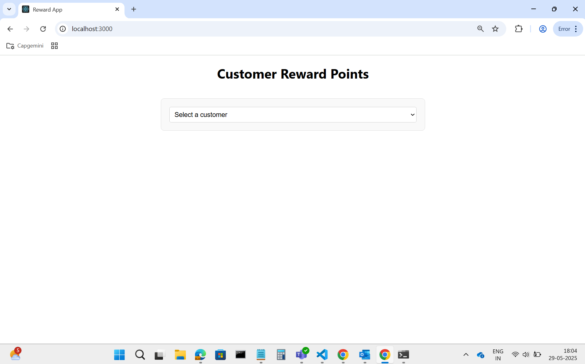
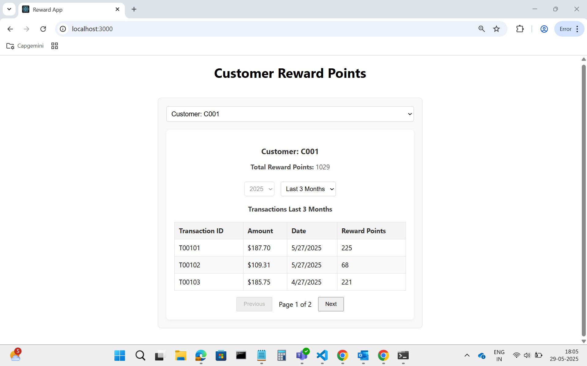
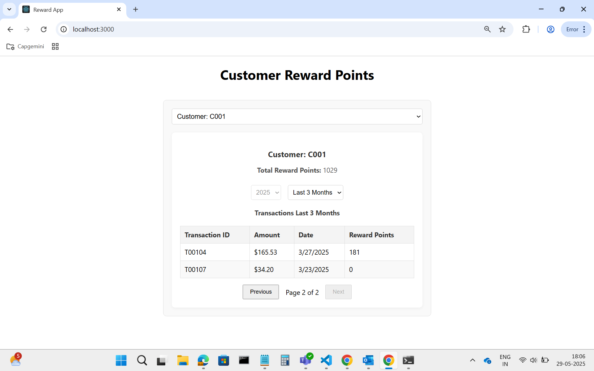
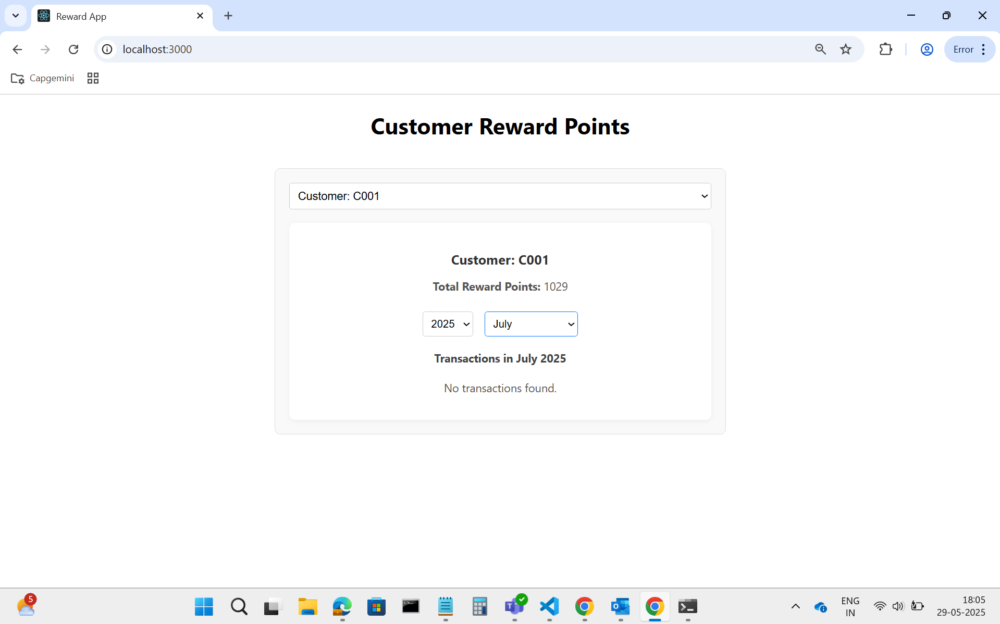
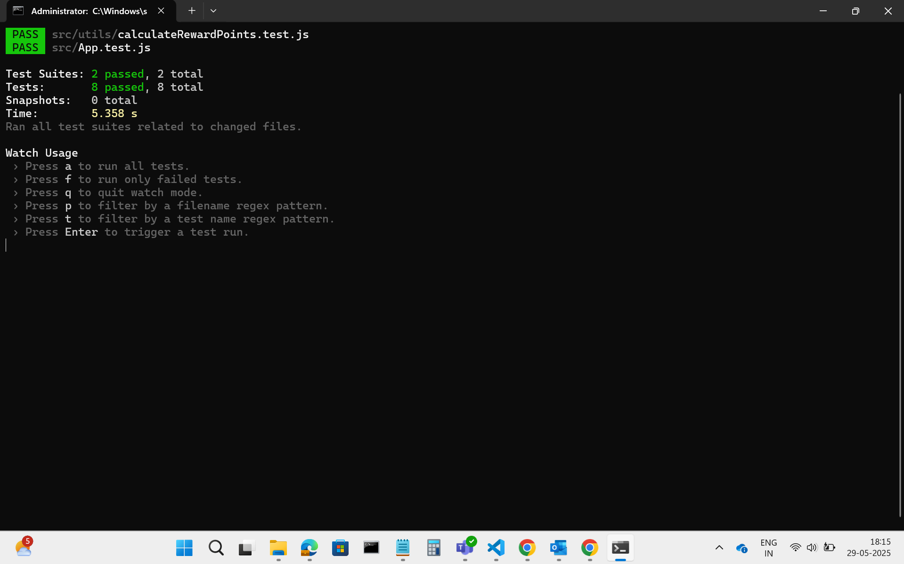

## Application Screenshot

Getting Started with Create React App

# Reward App

A React application to view customer reward points based on their transaction history.

## Features

- View a list of customers.
- Select a customer to see their total reward points.
- Filter transactions by year, month, or last 3 months.
- Paginated transaction table with reward points calculation.

## Reward Points Calculation

- 2 points for every dollar spent over $100 in a single transaction, plus
- 1 point for every dollar spent over $50 up to $100.

## Project Structure

```
reward-app/
  public/
    data/transactions.json   # Sample transaction data
  src/
    api/                    # API utilities
    components/             # React components
    constants/              # App constants
    loggers/                # Logging utilities
    utils/                  # Utility functions
    App.js                  # Main app component
```

## Getting Started

### Prerequisites

- Node.js (v23.11.0)
- npm

### Installation

1. Clone the repository:

   ```sh
   git clone https://github.com/Rajendra37/reward-app-repo/tree/main/reward-app
   cd reward-app
   ```

2. Install dependencies:
   ```sh
   npm install
   ```

### Running the App

```sh
npm start
```

The app will be available at [http://localhost:3000](http://localhost:3000).

### Running Tests

```sh
npm test
```

## Customization

- To modify transaction data, edit [`public/data/transactions.json`](public/data/transactions.json).
- To change reward calculation logic, update [`src/utils/calculateRewardPoints.js`](src/utils/calculateRewardPoints.js).

## Application Working ScreenShots

#
#
#
#

## Test Cases Running Scrrenshots

#
